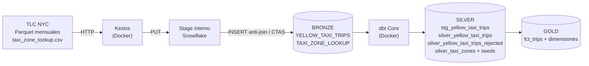
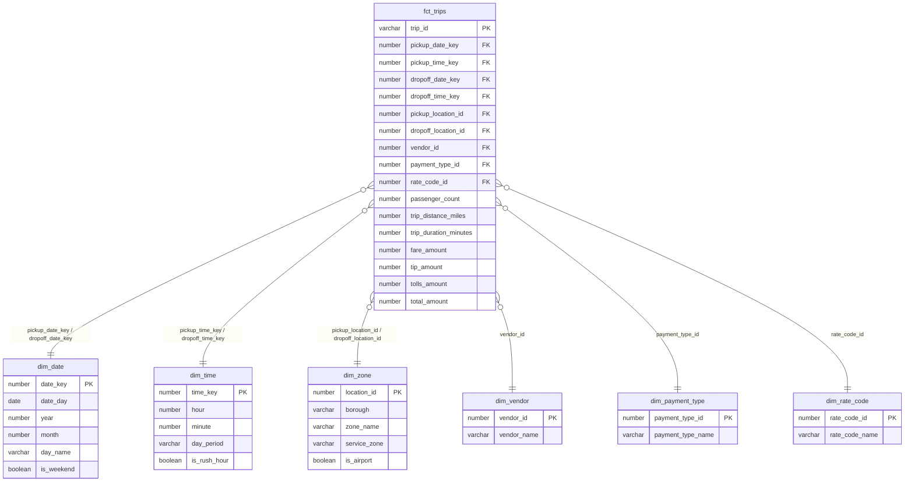

Laboratorio Integrador I
Objetivo
Construir una tubería ELT reproducible que ingiera, almacene, transforme y modele los datos de NYC Yellow Taxi.

Datos
Utilicen los datos de NYC Yellow Taxi correspondientes a:

Enero–diciembre de 2025.

Enero–agosto de 2026.

En total deben procesar 20 meses de datos.

Requerimientos
Levanten la infraestructura necesaria para ejecutar la tubería completa.

La solución debe:

Ingresar automáticamente los archivos de NYC Yellow Taxi.

Cargar los datos originales en Snowflake.

Implementar las transformaciones utilizando dbt.

Organizar los modelos utilizando una arquitectura de Bronze → Silver → Gold.

Bronze
Mantener los datos lo más cercanos posible a la fuente original.

Agregar metadata que permita identificar:

Archivo o período de origen.

Fecha de carga.

Silver
Limpiar y estandarizar los datos aplicando las dimensiones de calidad de datos.

Deben tratar:

Tipos de datos.

Valores nulos.

Duplicados.

Registros inválidos.

Nombres y formatos inconsistentes.

Las decisiones de limpieza deben estar justificadas.

Gold
Construir un esquema estrella orientado al análisis de los viajes.

Debe existir:

Una tabla de hechos.

Las dimensiones necesarias para analizar los viajes desde diferentes perspectivas.

Definan correctamente:

Grano de la tabla de hechos.

Primary keys de las dimensiones.

Foreign keys entre hechos y dimensiones.

Métricas y atributos.

Validación
Incluyan pruebas de dbt para validar al menos:

not_null

unique

relationships

La tubería debe poder ejecutarse nuevamente sin generar duplicados ni inconsistencias.

Entrega
En el repo de la clase, crear en la carpeta de labs la carpeta semana-07 y ahí adentro el laboratorio; subir solo el link de su github.

Entreguen:

Código de infraestructura.

Código de ingesta.

Proyecto dbt.

Diagrama de la arquitectura.

Diagrama del esquema estrella.

README con instrucciones para levantar y ejecutar la solución.

Al finalizar, debe ser posible ejecutar el pipeline desde cero y obtener en Snowflake las capas Bronze, Silver y Gold listas para el análisis.

Apóyense en la IA para resolver este laboratorio.

## Levantar Kestra localmente

Requiere Docker Desktop en ejecución. Desde esta carpeta:

```bash
docker compose up -d
```

Abra [http://localhost:8080](http://localhost:8080) para acceder a Kestra. El archivo `docker-compose.yml` inicia Kestra y una base PostgreSQL para guardar sus flujos y ejecuciones. Para revisar su estado use `docker compose ps`; para detenerlo, `docker compose down`. Los datos persisten en volúmenes de Docker.

En el primer acceso, complete el registro inicial de Kestra con un correo y una contraseña propios.

### Flujo de ingesta Bronze

El flujo está en [`flows/nyc_yellow_taxi_bronze.yml`](flows/nyc_yellow_taxi_bronze.yml). Descarga los Parquet oficiales de TLC, los sube a un stage interno de Snowflake y carga una tabla Bronze con el registro original, el mes, el archivo, el número de fila y la fecha de carga. Procesa hasta 4 meses en paralelo. Cada mes se carga con un `INSERT` que omite las filas ya presentes (mismo archivo y número de fila), así que una nueva ejecución no duplica datos. Se usa `INSERT` y no `MERGE` porque Snowflake permite varios `INSERT` simultáneos sobre la misma tabla, mientras que los `MERGE` se bloquean entre sí.

1. La base de datos de Snowflake debe existir. El rol configurado necesita `USAGE` sobre el warehouse y la base de datos y `CREATE SCHEMA` sobre la base. Si falta este último permiso, un administrador puede ejecutar `GRANT CREATE SCHEMA ON DATABASE <BASE_DE_DATOS> TO ROLE <ROL_DE_KESTRA>;`. El esquema que crea el flujo alojará el formato de archivo, el stage y la tabla.
2. Copie `.env_encoded.example` a `.env_encoded`. Reemplace cada valor por el dato correspondiente codificado con `printf %s 'valor' | base64`. El identificador de cuenta debe ser solo la parte previa a `.snowflakecomputing.com`. El archivo `.env_encoded` está excluido de Git. Base64 no cifra secretos; mantenga ese archivo privado.
3. Snowflake puede exigir MFA para el acceso con contraseña. Este flujo usa autenticación con par de claves. Genere una clave RSA de al menos 2048 bits y registre su clave pública en el usuario de Snowflake con `ALTER USER <usuario> SET RSA_PUBLIC_KEY='<clave_publica_sin_cabeceras>';`. Guarde la clave privada PEM y su frase de paso como `SECRET_SNOWFLAKE_PRIVATE_KEY` y `SECRET_SNOWFLAKE_PRIVATE_KEY_PASSWORD` en `.env_encoded`, codificadas en Base64. La clave privada nunca debe subirse al repositorio.
4. Reinicie Kestra con `docker compose up -d` para cargar las variables.
5. No hace falta importar el flujo desde la interfaz. La carpeta `flows/` se monta en solo lectura en el contenedor, y Kestra carga sus archivos al arrancar (`--flow-path`). Después de editar un flujo, ejecute `docker compose restart kestra`.
6. Al ejecutar el flujo, elija el rango con los selectores de fecha **Desde** (`start_month`) y **Hasta** (`end_month`). Solo cuentan el año y el mes, y se procesan todos los meses entre ambos, extremos incluidos. Por defecto el rango va de enero de 2025 a julio de 2026 (19 meses). Si "Hasta" es anterior a "Desde", el flujo falla antes de conectarse a Snowflake. Luego revise `SELECT SOURCE_MONTH, COUNT(*) FROM <BASE_DE_DATOS>.BRONZE.YELLOW_TAXI_TRIPS GROUP BY 1 ORDER BY 1;` en Snowflake.

Actualmente la página oficial de TLC publica hasta julio de 2026. Cuando se publique el Parquet de agosto, ejecute el flujo con Desde = Hasta = agosto de 2026 para completar los 20 meses pedidos. Volver a cargar un mes ya cargado no duplica filas.

El flujo también descarga `taxi_zone_lookup.csv` de TLC y lo carga en `BRONZE.TAXI_ZONE_LOOKUP`, que alimenta la dimensión de zonas. Esa tabla se reemplaza completa en cada ejecución.

## Transformaciones con dbt (Silver y Gold)

El proyecto dbt está en [`dbt/`](dbt/). Corre en un contenedor Docker con dbt Core y el adaptador de Snowflake. Usa las mismas credenciales de `.env_encoded`: el script [`dbt/scripts/with_snowflake_env.sh`](dbt/scripts/with_snowflake_env.sh) las decodifica y escribe la clave privada en un archivo temporal que se borra al terminar.

```bash
docker compose build dbt
```

```bash
docker compose run --rm dbt debug
```

```bash
docker compose run --rm dbt build
```

`dbt build` carga los seeds, crea los modelos y ejecuta todas las pruebas. Los modelos grandes son incrementales con `MERGE` por llave; reexaminar la última marca `loaded_at` evita perder filas con la misma fecha de carga sin generar duplicados. Como cambió el cálculo de `trip_id` para incluir `is_store_and_forward`, las tablas ya creadas deben reconstruirse una vez con `docker compose run --rm dbt build --full-refresh` antes de volver a usar el build incremental.

### Orden de ejecución desde cero

1. `docker compose up -d` y ejecutar en Kestra el flujo `nyc_yellow_taxi_bronze` con todos los meses.
2. `docker compose build dbt`
3. `docker compose run --rm dbt build`

### Arquitectura



### Silver: decisiones de limpieza

| Dimensión de calidad | Tratamiento | Justificación |
| --- | --- | --- |
| Tipos de datos | Los campos del `VARIANT` se convierten a `TIMESTAMP_NTZ`, `NUMBER(12,2)`, `NUMBER` y `BOOLEAN`. Los timestamps vienen como enteros en microsegundos y se convierten con la macro `variant_to_timestamp`. | Permite filtrar, agregar y unir con tipos correctos. |
| Nombres y formatos | snake_case con sufijos de unidad (`_amount`, `_miles`, `_minutes`). `store_and_fwd_flag` Y/N pasa a booleano. `Airport_fee` y `airport_fee` se unifican. | TLC mezcla mayúsculas y cambió nombres entre años. |
| Nulos | `rate_code_id` nulo → 99 (código "Null/unknown" de TLC). `passenger_count` 0 → nulo. Recargos nulos → 0. `passenger_count` nulo no se imputa. | 0 pasajeros es un dato no capturado, no un viaje vacío. Los recargos son componentes aditivos de `total_amount`. Imputar pasajeros sesgaría los análisis. |
| Duplicados | `trip_id` incluye los atributos estandarizados del viaje, también `is_store_and_forward`. Si se repite, se conserva la primera carga. | Dos filas idénticas representan el mismo viaje; diferencias en la marca de almacenamiento ya no se colapsan. |
| Registros inválidos | Las conversiones numéricas fallidas quedan marcadas como `invalid_numeric`. Los registros que incumplen alguna regla se excluyen de Silver y se guardan en `silver_yellow_taxi_trips_rejected` con el motivo en `dq_issue`: timestamps faltantes, subida fuera del mes del archivo, duración ≤ 0 o > 24 h, zona fuera de 1–265, distancia negativa o > 500 millas, montos faltantes o negativos. | No se pierden datos en silencio y se puede auditar cada exclusión. Los montos negativos son reembolsos o anulaciones y distorsionan los ingresos. |

### Gold: esquema estrella

- **Grano de `fct_trips`:** un viaje válido.
- **Primary keys:** `date_key` (YYYYMMDD), `time_key` (HHMM), `location_id`, `vendor_id`, `payment_type_id` y `rate_code_id`. Las dimensiones de catálogo incluyen el miembro `-1` para códigos fuera del diccionario de TLC.
- **`dim_zone`** cumple dos roles: zona de subida y zona de bajada.



### Pruebas

Los archivos `schema.yml` definen `unique` y `not_null` en todas las primary keys, `relationships` desde cada foreign key de `fct_trips` hacia su dimensión y `accepted_values` sobre los motivos de rechazo.
